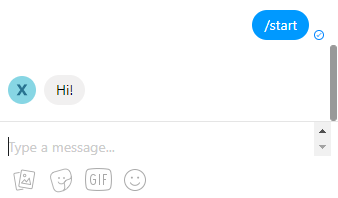
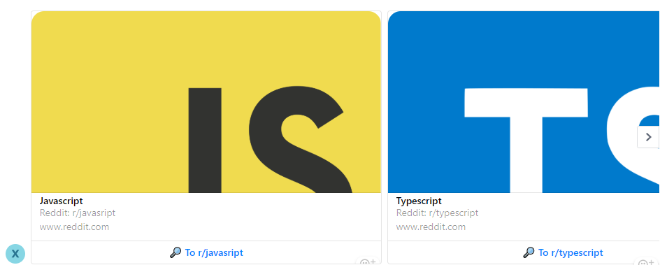

<p align="center">
    
</p>
<h2 align="center">Ant:Messenger</h2>
<p align="center">
  Tiny but powerful framework for <a href="https://www.messenger.com">Messenger</a> chat bots.
</p>
<p align="center">
    <a href="https://www.npmjs.com/package/ant-messenger">
        
    </a>
    <a href="https://www.npmjs.com/package/ant-messenger">
        
    </a>
    <a href="https://travis-ci.org/Xeelley/AntMessenger">
        
    </a>
</p>


## List of content ##

About:
- [Basic features](#Basic-features) 
- [Instalation](#Instalation) 
- [Basic usage](#Basic-usage) 
- [Ant anatomy](#Ant-anatomy) 
- [Deep linking](#deep-linking)
- [Config](#Config)


## Basic features ##

- Status-based user dialog stage managment.
- Easy-to-use.
- Webhook & polling support.
- All in one: all API methods, flexible dialog flow control.
- w/o functional overkill, nothing extra.


## Instalation ##

- Using [NPM](https://www.npmjs.com/):  
`npm install ant-messenger`
- Using [Yarn](https://yarnpkg.com/en/):  
`yarn add ant-messenger`


## Basic usage ##

Ant:Messenger require to provide 2 basic status managment async methods: for getting status to user by messenger user's `id`, and for setting it.  
Feel free to chose storing way (architecture, database etc.). We require next interfaces only:
```ts
getStatus(id: string): Promise<string>;
setStatus(id: string, status: string): Promise<any>;
``` 

Just put in on Ant:Messenger initialization with access token ([how to get token?](https://developers.facebook.com/docs/messenger-platform/getting-started/app-setup/)):
```js
const { AntMessenger } = require('ant-messenger');

const token = '...'; // Your access token

const Ant = new AntMessenger(token, { 
    getStatus: (id) => { ... }, 
    setStatus: (id, status) => { ... },
});
```

Explore quick start [example](docs/mongo-status-example.md) using [MongoDB](https://www.mongodb.com/) + [mongoose](https://www.npmjs.com/package/mongoose).

Facebook Messenger use webhook for API communication, so you need to configure it:

1. Create [Express](https://expressjs.com/) server:

```js
const express = require('express');
const app = express();
```

2. Add router using webhook url:

```js
const webhookUrl = '/webhook'; // webhook url here
app.get(webhookUrl, Ant.validateServer);
app.post(webhookUrl, (req, res) => {
    const payload = req.body;
    Ant.inspect(payload);
    res.status(200).send();
})
```

3. Run your server:

```js
app.listen(port);
```


Now you ready to use Ant:Messenger.  
Let's add start dialog handler (`/start` command, called either when command was send as text or when new user join to chat with bot):
```js
Ant.command('/start', async id => {
    await Ant.api.sendTextMessage(id, 'Hi!');
})
```

Your bot ready to start. Run script and make sure it works:  




## Ant anatomy ##

### Messenger API 

See `Ant.api`

All api methods like 
```ts
Ant.api.sendQuickReplyMessage(id: string, text: string, buttons?: Button[]): Promise;
Ant.api.toggleTyping(id: string, toggle: boolean): Promise;
``` 
... and so on. See full list in [fb-messenger-bot-api](https://www.npmjs.com/package/fb-messenger-bot-api) dependency.


### Error handling

```js
Ant.on('error', (err: Error) => { ... })
```

`error` will fire on any error. If error caused during user's scenario, error will have `sender_id` extra field.


### Statuses

Set status for user:
```js
await Ant.status(id, 'my_status');
```

And add listener for this status: 
```js
Ant.add('image', 'my_status', (id, image) => { ... })
```
First argument is user interaction type, second - our status, third - callback.  
Callback will invoke every time when user with this status send photo to bot.  
Full list of available types and callbacks you can check [here](docs/event-types.md).


### Commands

Add command handlers using `Ant.command`:
```js
Ant.command(command, (chat_id, params) => { ... })
```
Command may contain `/` if needed (example: `/start`).
Callback will invoke every time when user send this command to chat. Status will be ignored (works with any user's status).  
  
`Ant.command` support url params for commant that will returns as `params` in callback. Empty object will returns if params not provided.  
For example:  

| User input | `params` value |
|------------|----------------|
| `/cmd` | `{}` |
| `/cmd?item=apple&amount=2` | `{ item: 'apple', amount: '2' }` |

Notice: all param values are strings. You need to parse params by youself if you need to support other types in command params.  


### Masks 

You can use multi-leveled statuses using level separator (`:` by default). It can be changed using `maskSeparator` field in initial config.   
For example: 
```js
await Ant.status(chat_id, 'buy:fruit:apple')
```
Provided status has 3 levels: action (`buy`), category (`fruit`), item (`apple`) and can be used during user interaction  with shopping cart.  
You not need to set listeners using `Ant.add` for each item on third level. You can use mask (`*`):
```js
// Mask value (item, in our case) will be provided as third callback parameter.
Ant.add('text_message', 'buy:fruit:*', (id, text, item) => {
    console.log(item) // apple
})
```
Callback will invoke for any text message send by user with any item in status.


### Builders ### 
See `Ant.Types`

Ant:Messenger simplifies api methods usage with builders.  
Let's check an example:
```js
const GenericTemplate = Ant.Types.GenericTemplate;
const GenericElement  = Ant.Types.GenericElement;
const DefaultAction   = Ant.Types.DefaultAction;
const Button          = Ant.Types.Button;
await Ant.api.sendTemplateMessage(id, new GenericTemplate([
        new GenericElement('Javascript', js_image, 'Reddit: r/javasript', 
            new DefaultAction('https://www.reddit.com/r/javascript/'), [
                new Button('🔎 To r/javasript', 'site', 'web_url', 'https://www.reddit.com/r/javascript/')
            ]
        ),
        new GenericElement('Typescript', ts_image, 'Reddit: r/typescript', 
            new DefaultAction('https://www.reddit.com/r/typescript/'), [
                new Button('🔎 To r/typescript', 'site', 'web_url', 'https://www.reddit.com/r/typescript/')
            ]
        )
    ]));
```
Here we are using builders instead of define structure object.  
This code will send generic template with two cards:




### Native API payload handling ###

Ant:Messenger handle API payload by itself inside the `Ant.inspect` method (see [basic usage](#Basic-usage)).  
You can handle payload by yourself:

1. Working with native data that was sent on webhook:

```js
app.post(webhookUrl, (req, res) => {
    console.log(req.body); // API data
})
```

2. Working with parsed API payload:
```js
app.post(webhookUrl, (req, res) => {
    const payload = Ant.parsePayload(req.body);
    console.log(payload); // parsed API payload
})
```

## Deep linking ##
Facebook Messenger supports [deep linking](https://developers.facebook.com/docs/messenger-platform/discovery/m-me-links/) so you can create link like:
```
http://m.me/<PAGE_NAME>?ref=<REF_PARAM>
```
which start user scenario with ref value. You can handle context easily:
```js
// Via http://m.me/yourbot?ref=value
Ant.command('/start', async (id, params) => {
    console.log(params); // { ref: 'value' }
    console.log(params.ref) // 'value'
})
```
`Ant.command` listener provide params object as second parameter. It will be empty when user has been connected to bot 
without deep link.


## Config ##
Ant:Telegram init config contain next fields:

| field | type | description |
|-------|------|-------------|
| `setStatus` | | See [basic usage](#Basic-usage) 
| `getStatus` | | See [basic usage](#Basic-usage) 
| `maskSeparator` | `string` | See [masks](#Masks)
| `getStartedToken` | `string` | Payload string that Messenger API will use when new user join to chat with bot. `GET_STARTED` as default.
